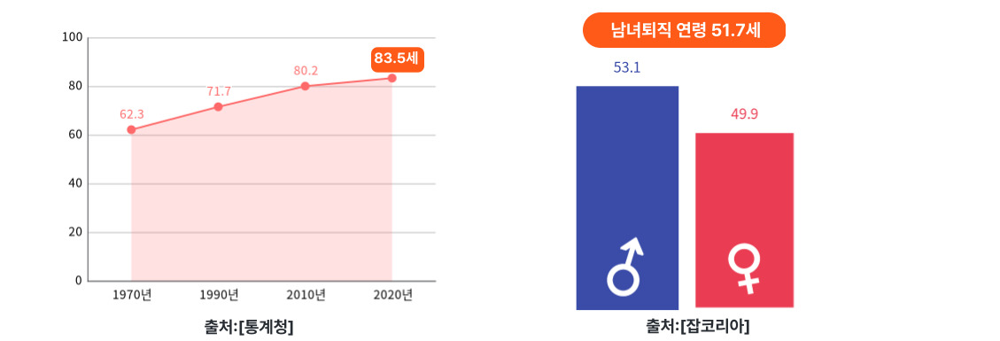

# 자산관리부터 재무설계까지 원큐에, 하나원큐레이터

[프로젝트 홈페이지 - https://koposoftware.github.io/2022_1_ekkoo/](https://koposoftware.github.io/2022_1_ekkoo/)

# 1. 프로젝트 개요
## * 프로젝트 배경
 
 
우리나라의 기대수명은 1990년 71.7세, 2010년 80.2세, 2020년 83.5세로 계속해서 증가하고 있습니다. 반면 퇴직시기는 계속해서 빨라지고 있습니다. 2020년 잡코리아에서 실시한 설문조사에 따르면 직장인 체감 퇴직 나이는 평균 51.7세인 것으로 나타났습니다. 돈을 벌 수 있는 소득 시기는 점점 줄어들고 있는 반면에, 소비 기간은 늘어나고 있어 재무적 위험성이 증가하고 있습니다. 이에 따라 체계적인 재무설계가 중요한 시기라고 느껴 재무설계 플랫폼을 제작하게 되었습니다.
  
## * 프로젝트 목적
본 프로젝트는 누구나 쉽고 정확한 재무 설계 서비스를 이용할 수 있다는 데에 의의를 두고 있습니다. 재무 설계 시, 홈택스 API와 연동을 통해 정확히 알기 어려운 신용 정보를 버튼 클릭 한 번으로 쉽게 값을 입력하여 신뢰성 있는 재무 설계 결과를 받을 수 있습니다. 또한 재무 설계를 통해 추천 받은 금융 상품을 조합하여 조합별 혜택 차이를 쉽게 비교할 수 있습니다.
  

# 2. 프로젝트 제안서

하나원큐레이터의 초기 프로젝트 제안 발표 자료입니다.
    
   [제안발표자료](/하나원큐레이터_제안발표.pptx) 
    

# 3. 프로젝트 결과
최종 프로젝트 결과입니다.
## * 발표 ppt 
    
   [최종발표자료](/하나원큐레이터_최종발표.pptx) 
## * 시연 동영상
   <iframe width="762" height="411" src="https://www.youtube.com/embed/q7JSWscW8a8" title="웹개발프로젝트_하나원큐레이터_시연영상" frameborder="0" allow="accelerometer; autoplay; clipboard-write; encrypted-media; gyroscope; picture-in-picture" allowfullscreen></iframe>
  

# 4. 프로젝트 결과 요약

## * 수행기간
   2022-09-16 ~ 2022-10-24

## * 담당업무
   하나원큐레이터 프로젝트 설계 및 제작, Front-End/Back-End 개발

## * 주요기능
    

## * 사용기술
- Spring-MVC 패턴
- Hometax OpenAPI 설계,제작,배포 
- Spring MailSender, CoolSMS API를 사용한 이메일, 문자 알림
- Spring Scheduler와 Spring Jsoup을 활용한 주식 평가금 실시간 업데이트

## * 개발환경
- OS : Window10, Oracle Linux
- Framework : Spring Framework, Mybatis
- Server : Apache Tomcat9
- Language : Java(jdk-1.8), Python, Javascript, HTML, CSS 
- IDE Tools : Eclipse, Sqldeveloper
- DB : Oracle 19c
- Library : jQuery, JSTL, Bootstrap, Datatables

## * ERD
    
## * 시스템 아키텍쳐
    
   
## * 서비스 아키텍쳐
    
         
# 4. OpenAPI 제작
하나원큐레이터의 재무설계시, 자동으로 나의 신용정보를 불러오는 기능을 구현하기 위해 가상의 홈택스 OpenAPI를 개발/서버 구축/배포를 하였습니다.  
  
 
[openAPI명세서](/openAPI명세서.hwp) 
    
# 5. 본인 소개
| 항목      | 내용                | 내용         |
|----------|---------------------------|------------------------------------------|
| **이름** |구이경|
| **연락처** | ddowei92@naver.com | [깃블로그](https://yoon-ddo.github.io/) |
| **학력사항** | 졸업(2022.02) | 한성대학교 전자트랙 |
| **skill set** || Frontend - HTML, CSS, Javascript Backend - Java, Python, C DataBase - Oracle |
| **자격증** | 2022.05 | SQLD ( 한국데이터산업진흥원 ) |
| **교육이력** | 2022.03 ~ 2022.10 | 하나금융티아이 채용전환형 교육 1200시간( 한국폴리텍대학교 광명융합기술교육원 - 데이터분석과 ) |
| **어학능력** | 2021.10 | TOEIC 860 |

